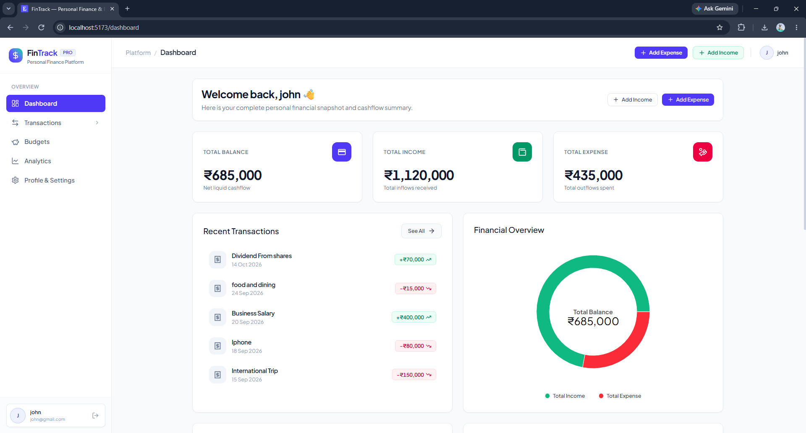
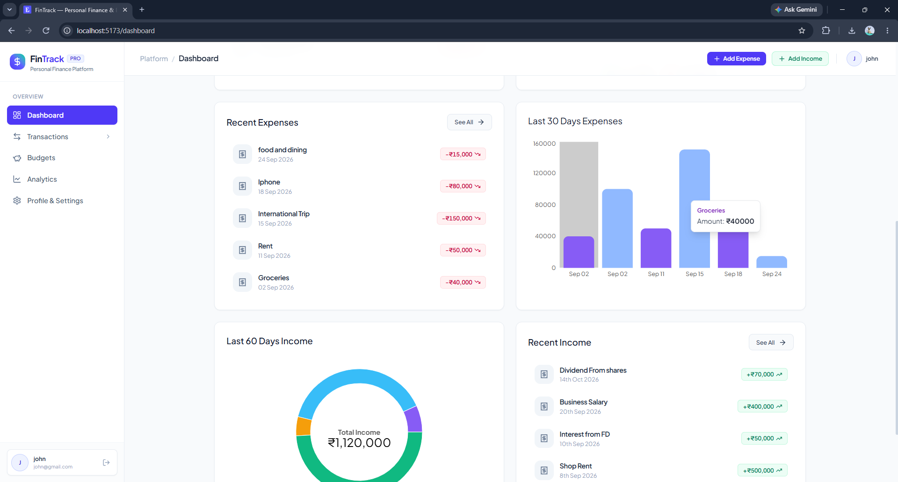
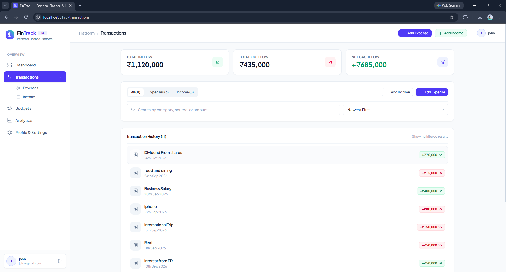
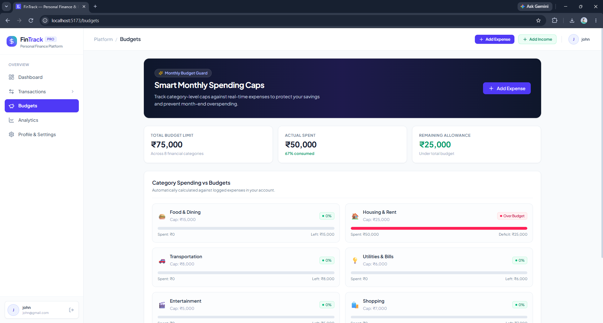
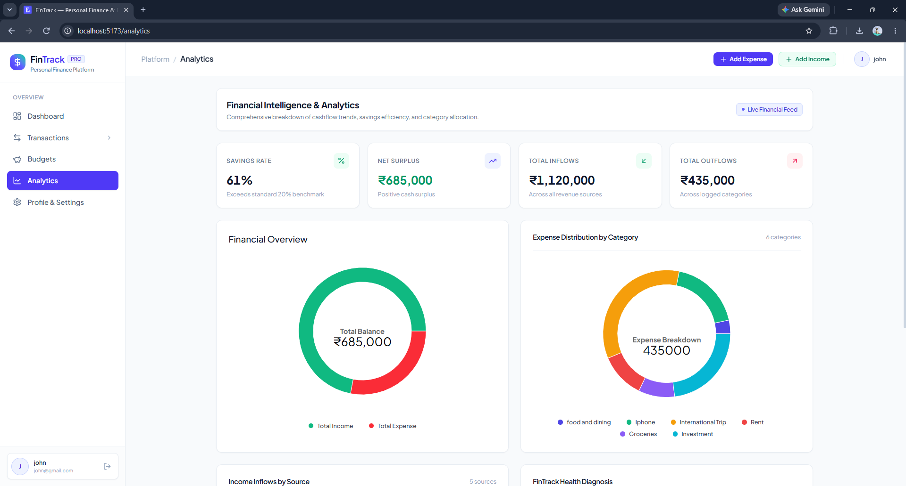
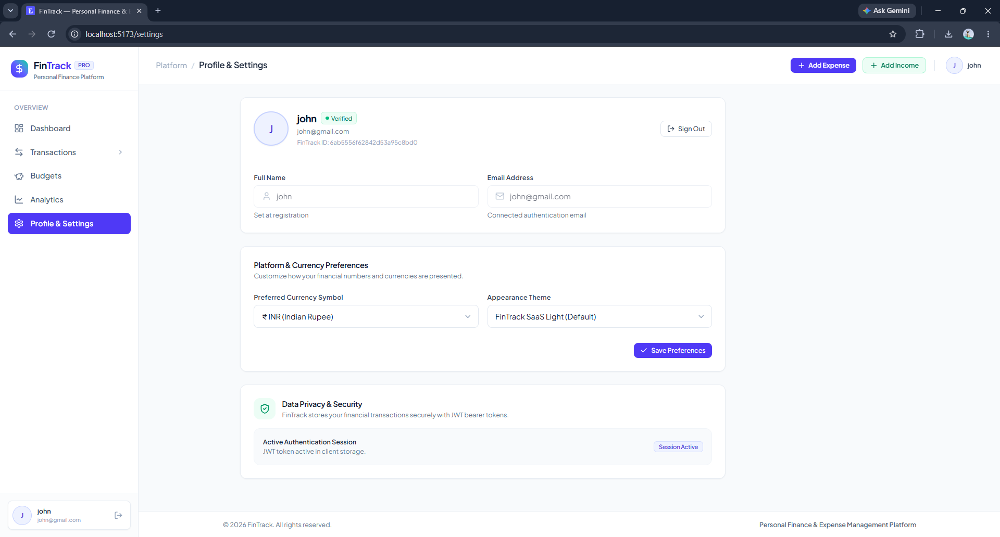
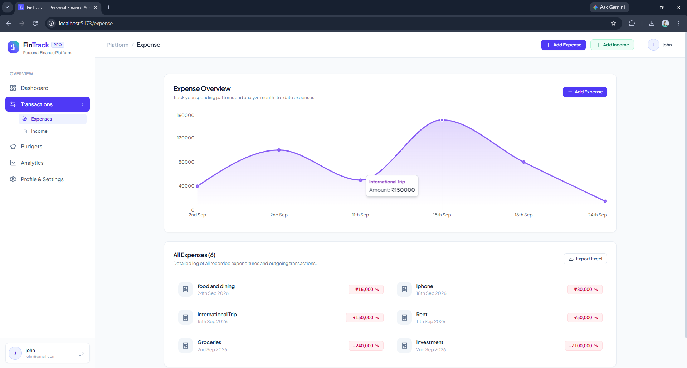
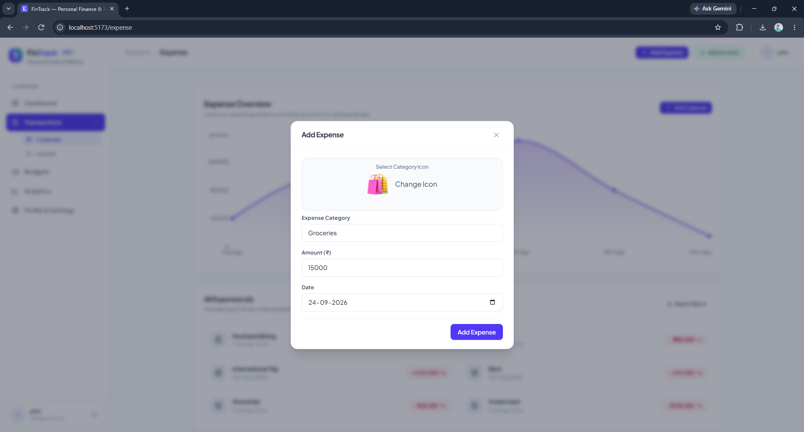
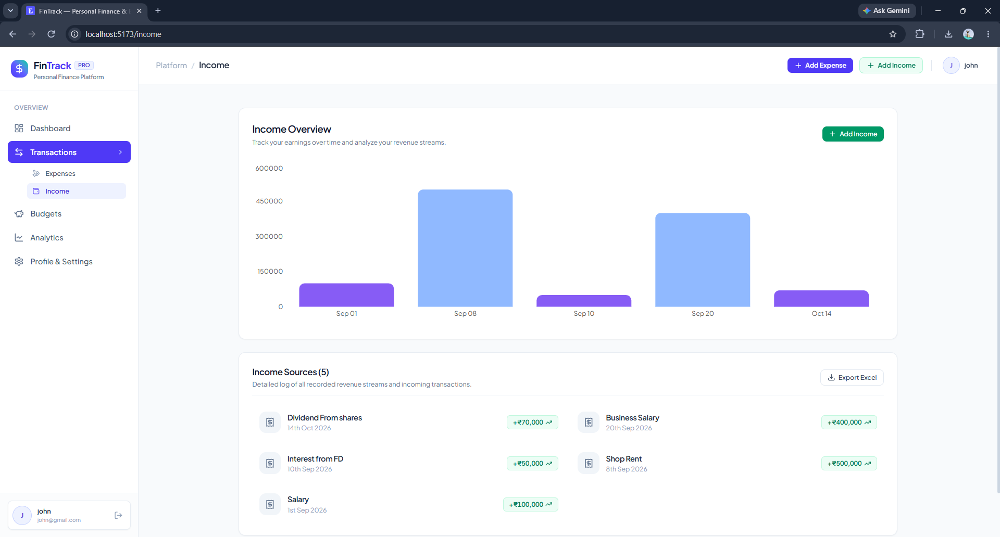

# FinTrack

**Personal Finance & Expense Management Platform**

FinTrack is a full-stack web application for managing personal finances — track income and expenses, set category budgets, analyze spending, and export financial data.

## ✨ Features

- 🔐 JWT authentication with bcrypt password hashing
- 📊 Financial dashboard with income, expenses, balance & analytics
- 💸 Income and expense management
- 🔎 Search, filter & sort transactions
- 🎯 Category-based monthly budgets
- 📈 Interactive financial charts and spending analytics
- 📁 Export transactions to `.xlsx` and `.csv`
- 👤 Profile avatar uploads
- 📱 Responsive UI for desktop, tablet & mobile

## 🛠 Tech Stack

**Frontend**
- React 19
- Vite
- Tailwind CSS
- React Router
- Recharts
- Axios

**Backend**
- Node.js
- Express.js
- JWT
- bcryptjs
- Multer
- SheetJS

**Database**
- MongoDB
- Mongoose

**Tools**
- Git & GitHub
- Vercel

## 📸 Preview

<p align="center">
  
</p>

| Dashboard Activity & Cashflow | Transaction Ledger & Filtered Export |
| :---: | :---: |
|  |  |

| Smart Monthly Spending Caps | Financial Analytics & Health Score |
| :---: | :---: |
|  |  |

| Multi-Segment Analytics Breakdown | Categorized Expense Overview |
| :---: | :---: |
|  |  |

| Expense Logging Modal Flow | Revenue Streams Management |
| :---: | :---: |
|  |  |

## 📁 Structure

```text
FinTrack/
├── backend/
│   ├── config/
│   ├── controllers/
│   ├── middleware/
│   ├── models/
│   ├── routes/
│   └── server.js
│
├── frontend/
│   ├── public/
│   └── src/
│       ├── components/
│       ├── context/
│       ├── hooks/
│       ├── pages/
│       └── utils/
│
├── snapshots/
├── vercel.json
└── README.md
```

## 🚀 Getting Started

### 1. Clone

```bash
git clone https://github.com/aakashaygonde/FinTrak.git
cd FinTrak
```

### 2. Configure Environment

Create `.env` files using the provided examples:

```text
backend/.env
frontend/.env
```

**Backend**

```env
PORT=8000
MONGO_URI=your_mongodb_uri
JWT_SECRET=your_jwt_secret
CLIENT_URL=http://localhost:5173
```

**Frontend**

```env
VITE_BASE_URL=http://localhost:8000
```

### 3. Run Backend

```bash
cd backend
npm install
npm start
```

### 4. Run Frontend

```bash
cd frontend
npm install
npm run dev
```

The application will be available at:

```text
http://localhost:5173
```

## 🔮 Roadmap

- Recurring transactions
- Multi-currency support
- Automated PDF statements
- Bank statement import

## 👨‍💻 Author

**Aakash Haygonde**

[GitHub](https://github.com/aakashaygonde)
